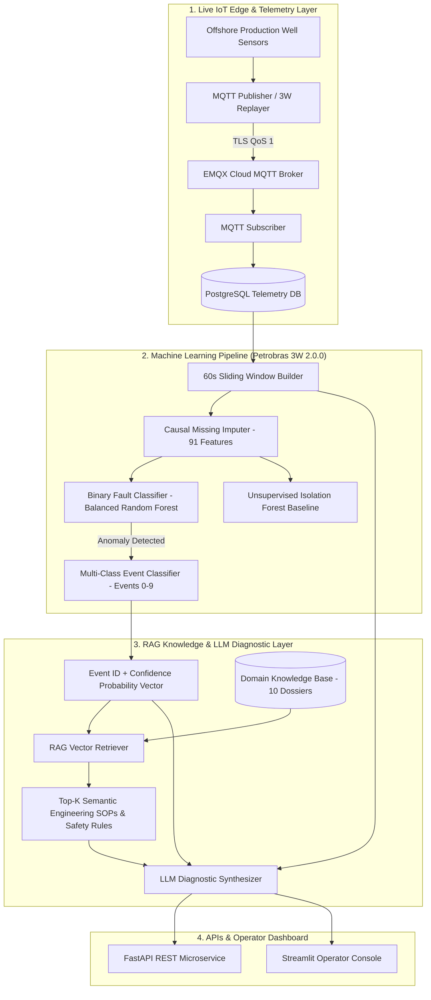

# Knowledge-Driven IoT Fault Diagnosis Assistant for Oil & Gas

An end-to-end Industrial IoT (IIoT) fault detection, multi-class event classification, and explainable AI diagnostic assistant designed for offshore oil and gas production wells. Built on the benchmark **Petrobras 3W Dataset 2.0.0**, combining real-time telemetry streaming, causal machine learning, Retrieval-Augmented Generation (RAG), and Large Language Model (LLM) reasoning.

---

## 📌 Architecture Overview



---

## ⚡ Key Capabilities

1. **Real-Data ML Models:** Trained on **1,119 real well recordings** (481,883 60-second window observations) from the **Petrobras 3W Dataset 2.0.0**.
2. **Causal Preprocessing:** Strictly causal forward-fill (`limit=60s`) without lookahead bias, coupled with a median imputer fitted on the training partition.
3. **Leakage-Free Validation:** Stratified recording-instance splitting preventing temporal autocorrelation leakage.
4. **Transient vs Established Fault Breakdown:** Evaluates detection sensitivity on developing incipient phase (classes 101-109) versus steady-state faults (classes 1-9).
5. **RAG Technical Domain Knowledge:** 10 curated offshore engineering dossiers covering symptoms, root causes, operator verification SOPs, and safety considerations.
6. **Structured Explainable AI Diagnosis:** Synthesizes model predictions and telemetry anomalies into operator checklists and safety advisories without silent overrides.
7. **Real-Well Telemetry Replayer:** Replays genuine 3W held-out recordings over MQTT/EMQX into the real-time detection pipeline.

---

## 🏆 Model Benchmark Results

Evaluated on **116,016 held-out test windows** (224 real recordings):

| Model Architecture | Task | Accuracy | Precision | Recall | F1-Score | Macro F1 | ROC-AUC |
| :--- | :--- | :---: | :---: | :---: | :---: | :---: | :---: |
| **Random Forest (Balanced)** | **Binary (Normal vs Fault)** | **74.17%** | **90.72%** | **61.23%** | **73.12%** | **74.13%** | **0.9210** |
| **HistGradientBoosting** | Binary (Normal vs Fault) | 73.78% | 94.73% | 57.49% | 71.55% | 73.61% | 0.9301 |
| **Logistic Regression (Scaled)** | Binary (Normal vs Fault) | 84.42% | 88.40% | 83.84% | 86.06% | 84.20% | 0.8766 |
| **Random Forest (Balanced)** | **Multi-Class (Events 0-9)** | **72.76%** | **58.27%** | **59.05%** | **71.08%** (Weighted) | **56.57%** | — |
| **HistGradientBoosting** | Multi-Class (Events 0-9) | 74.58% | 65.44% | 62.01% | 72.53% (Weighted) | 61.72% | — |
| **Logistic Regression (Scaled)** | Multi-Class (Events 0-9) | 67.13% | 50.97% | 60.22% | 68.83% (Weighted) | 50.57% | — |

### Transient vs Established Fault Recall (Random Forest):
- **Established Faults (Classes 1–9):** **91.57% Recall** / **90.56% Multi-class Accuracy**
- **Transient Developing Faults (Classes 101–109):** **54.81% Recall** / **50.80% Multi-class Accuracy**

---

## 📂 Project Structure

```text
knowledge_iot_fault_diagnosis/
├── api/
│   └── main.py                     # FastAPI REST API (/health, /predict, /diagnose, /telemetry)
├── config/                         # System configuration parameters
├── dashboard/
│   └── app.py                      # Interactive Streamlit operator console
├── data/
│   ├── processed_3w_features.parquet # Preprocessed 60s feature matrix (481,883 rows)
│   ├── train_features.parquet      # Leakage-free training partition (365,867 rows)
│   ├── test_features.parquet       # Held-out testing partition (116,016 rows)
│   └── processed_features_sample.csv # Inspection sample CSV
├── database/
│   ├── db.py                       # PostgreSQL connection & telemetry ingestion
│   └── schema.py                   # Relational database schema definitions
├── docs/
│   ├── ML_RESULTS.md               # Full academic experimental evaluation & audit
│   ├── MODEL_ARCHITECTURE.md       # Detailed ML & pipeline specifications
│   └── RAG_ARCHITECTURE.md         # RAG retrieval & LLM reasoning design
├── llm/
│   ├── client.py                   # Modular LLM client (Gemini / OpenAI / Offline Fallback)
│   ├── diagnosis.py                # Structured fault diagnosis generator
│   └── prompt.py                   # Engineering prompt templates
├── ml/
│   ├── detector.py                 # Unified real-time inference pipeline
│   ├── evaluate_well_disjoint.py   # Physical well-disjoint generalization evaluator
│   ├── feature_importance.py       # Top 20 sensor feature analyzer
│   ├── model_comparison.py         # Multi-model benchmark suite
│   ├── prepare_dataset.py          # 60s window feature extractor & cleaner
│   ├── train_anomaly.py            # Unsupervised Isolation Forest trainer
│   ├── train_binary.py             # Binary anomaly classifier trainer
│   └── train_multiclass.py         # Multi-class fault classifier trainer
├── models/
│   ├── binary_fault_model.joblib   # Trained binary classifier checkpoint
│   ├── feature_columns.json        # 91 feature tag definitions
│   ├── feature_imputer.joblib      # Training-fitted median imputer
│   ├── isolation_forest_model.joblib # Unsupervised baseline checkpoint
│   └── multiclass_fault_model.joblib # Trained multi-class event classifier
├── mqtt/
│   ├── config.py                   # EMQX Cloud MQTT broker credentials
│   ├── publisher.py                # MQTT telemetry publisher
│   └── subscriber.py               # MQTT subscriber with real-time ML hook
├── rag/
│   ├── documents/                  # 10 comprehensive domain knowledge dossiers
│   ├── ingest.py                   # Semantic markdown chunker & vector indexer
│   ├── retriever.py                # Context-aware knowledge retriever
│   └── vector_store.py             # Persistent lightweight vector store
├── results/
│   ├── binary_classification_report.txt
│   ├── multiclass_classification_report.txt
│   ├── confusion_matrix_binary.png
│   ├── confusion_matrix_multiclass.png
│   ├── feature_importance.png
│   └── model_comparison.csv
├── simulator/
│   ├── replay_petrobras.py         # Real-world 3W telemetry replayer
│   └── simulator.py                # Virtual IoT device simulator
├── tests/
│   └── test_pipeline.py            # Automated pytest test suite (9 tests)
├── requirements.txt
└── README.md
```

---

## 🚀 Quickstart Guide

### 1. Installation

```bash
# Clone the repository
git clone https://github.com/pixelrishabh/IOT_INDUSTRY_PROJECT.git
cd IOT_INDUSTRY_PROJECT

# Create virtual environment
python -m venv .venv

# Activate virtual environment
# Windows PowerShell:
.\.venv\Scripts\Activate.ps1
# Linux / macOS:
source .venv/bin/activate

# Install dependencies
pip install -r requirements.txt
```

### 2. Run Automated Test Suite

```bash
$env:PYTHONPATH="."
pytest tests/test_pipeline.py -v
```

### 3. Start the FastAPI Microservice

```bash
$env:PYTHONPATH="."
uvicorn api.main:app --host 0.0.0.0 --port 8000 --reload
```
- Swagger UI / OpenAPI docs: `http://localhost:8000/docs`
- Health check: `http://localhost:8000/health`

### 4. Launch the Streamlit Operator Dashboard

```bash
$env:PYTHONPATH="."
streamlit run dashboard/app.py
```
- Interactive Dashboard: `http://localhost:8501`

### 5. Stream Real Petrobras Well Telemetry via MQTT

```bash
# Stream 60 seconds of severe slugging from real Petrobras WELL-00001
$env:PYTHONPATH="."
python simulator/replay_petrobras.py --event 3 --max-rows 60
```

---

## 📊 Monitored Sensor Tags (Petrobras 3W)

- `P-PDG`: Pressure at Permanent Downhole Gauge (Pa)
- `P-TPT`: Pressure at Temperature & Pressure Transducer (Pa)
- `T-TPT`: Temperature at Temperature & Pressure Transducer (°C)
- `P-MON-CKP`: Upstream Pressure of Production Choke (Pa)
- `T-JUS-CKP`: Downstream Temperature of Production Choke (°C)
- `P-ANULAR`: Annulus 'A' Pressure (Pa)
- `T-PDG`: Temperature at Permanent Downhole Gauge (°C)
- `P-JUS-CKGL`: Downstream Pressure of Gas Lift Choke (Pa)
- `QGL`: Gas Lift Injection Flow Rate (m3/s)
- `ABER-CKP`: Production Choke Valve Opening (%)
- `ABER-CKGL`: Gas Lift Choke Valve Opening (%)
- `T-MON-CKP`: Upstream Temperature of Production Choke (°C)
- `P-JUS-CKP`: Downstream Pressure of Production Choke (Pa)

---

## 📜 License & Citation

The real well telemetry data is sourced from the **Petrobras 3W Dataset (Version 2.0.0)** licensed under the [Creative Commons Attribution 4.0 International License (CC BY 4.0)](https://creativecommons.org/licenses/by/4.0/).
