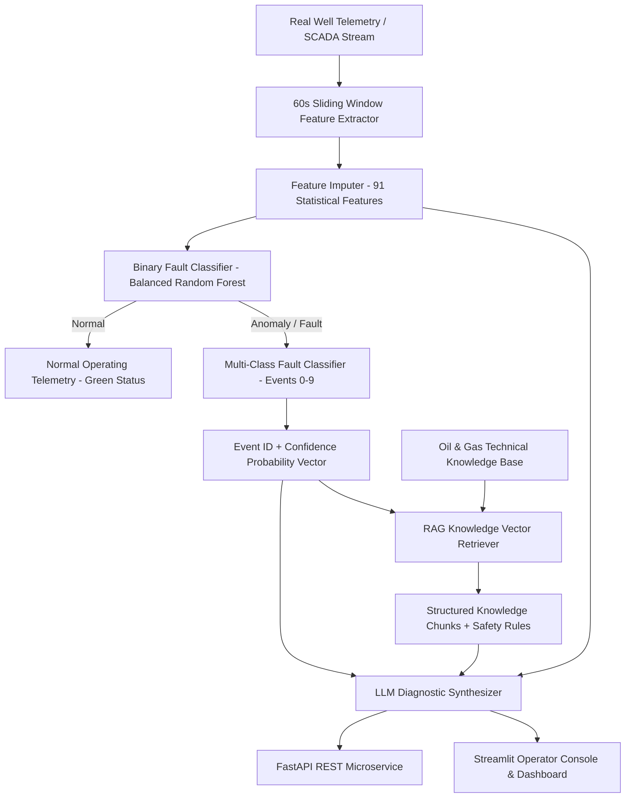

# System & Model Architecture — IoT Fault Diagnosis Assistant

## 1. System Architecture Overview

The system bridges industrial SCADA/MQTT edge telemetry with a 3-tier intelligence stack:
1. **Machine Learning Layer:** 60-second window statistical feature extraction, binary anomaly filtering, and multi-class fault classification.
2. **Retrieval-Augmented Generation (RAG) Layer:** Persistent vector database indexing petroleum engineering standard operating procedures (SOP), diagnostic checklists, and safety documentation.
3. **LLM Diagnostic Layer:** Synthesizes telemetry anomalies, ML model confidence, and retrieved technical domain knowledge into actionable operator reports.

---

## 2. Machine Learning Pipeline Specifications

### 2.1 Feature Engineering (91 Dimensions)
- Primary sensors: `P-PDG`, `P-TPT`, `T-TPT`, `P-MON-CKP`, `T-JUS-CKP`, `P-ANULAR`, `T-PDG`, `P-JUS-CKGL`, `QGL`, `ABER-CKP`, `ABER-CKGL`, `T-MON-CKP`, `P-JUS-CKP`.
- Window operations: Mean, Standard Deviation, Minimum, Maximum, Median, Amplitude Range ($\text{max} - \text{min}$), and Linear Trend ($\text{last} - \text{first}$).

### 2.2 Model Artifacts & Saved Checkpoints
- `models/feature_columns.json`: Exact 91 feature column ordering.
- `models/feature_imputer.joblib`: Preprocessing median imputer fitted on training instances.
- `models/binary_fault_model.joblib`: Binary classifier (Normal vs Fault).
- `models/multiclass_fault_model.joblib`: Multi-class classifier (Events 0-9).
- `models/isolation_forest_model.joblib`: Unsupervised normal baseline envelope detector.

---

## 3. Real-Time Inference & Deployment

- **Latency:** < 15 ms per telemetry window inference.
- **CPU Optimization:** Full pipeline runs on standard multicore CPU without dedicated GPU.
- **Edge Deployment:** Standalone Python package compatible with Docker, Kubernetes, or edge IPC devices.
