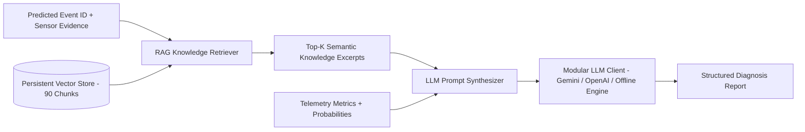

# RAG & LLM Diagnostic Architecture

## 1. Retrieval-Augmented Generation (RAG) Architecture

The RAG subsystem provides specialized technical domain knowledge to ground machine learning predictions and generate explainable, safe, and actionable diagnosis reports for platform operators.



---

## 2. Knowledge Base Documents

The knowledge base in `rag/documents/` contains structured engineering dossiers for offshore production systems:

1. `event_0_normal_operation.md`: Steady-state production window, nominal drawdown, baseline pressure gradients.
2. `event_1_abrupt_increase_bsw.md`: Water coning, hydrostatic loading, sweet corrosion risks, emulsion mitigation.
3. `event_2_spurious_closure_dhsv.md`: Hydraulic line bleed, flapper spring trips, water hammer prevention.
4. `event_3_severe_slugging.md`: Pipeline-riser hydrodynamic cyclic slugging, active choke control, separator tripping.
5. `event_4_flow_instability.md`: Casing heading, multiphase instability, sub-critical choke decoupling.
6. `event_5_rapid_productivity_loss.md`: Sand screen plugging, fines migration, asphaltene deposition envelope, matrix acid stimulation.
7. `event_6_quick_restriction_pck.md`: Debris ingestion, choke sleeve fracture, Joule-Thomson refrigeration.
8. `event_7_scaling_in_pck.md`: Calcium carbonate flashing, barium sulfate NORM precipitation, subsea chemical inhibition.
9. `event_8_hydrate_in_production_line.md`: Clathrate hydrate thermodynamic stability, continuous MEG/methanol dosing, two-sided depressurization SOP, missile projectile hazard.
10. `event_9_hydrate_in_service_line.md`: Gas lift line icing, dehydration dewpoint breakthrough, casing gas starvation.

---

## 3. Structured LLM Diagnostic Output Schema

Every diagnosis adheres strictly to the required offshore operator console format:

```text
FAULT DETECTION
----------------
Status: [NORMAL / ANOMALY]
Detected Event: [Event Description]
Confidence: [XX.X% (High / Moderate / Low)]

SENSOR EVIDENCE
----------------
- Sensor: [Tag]
  Observed Value: [Value + Unit]
  Expected Behavior: [Nominal Envelope]
  Significance: [Hydraulic / Thermal deviation impact]

POSSIBLE CAUSES
----------------
1. [Primary physical root cause]
2. [Secondary mechanical / chemical cause]
3. [Upstream / reservoir transition]

RECOMMENDED CHECKS
----------------
1. [Immediate non-intrusive diagnostic verification]
2. [Valve / choke / chemical rate adjustment SOP]
3. [Field / separator sampling action]

SAFETY NOTE
----------------
[Critical safety hazards, overpressure / ESD trip precautions, PPE warnings]

KNOWLEDGE SOURCES
----------------
[Referenced Technical Engineering Documents]
```

---

## 4. LLM Provider Flexibility & Edge Fallback

- **Google Gemini API:** Fast, high-reasoning cloud inference via REST API.
- **OpenAI / Ollama Local:** Direct support for local open-source LLMs (Llama 3, Mistral) via OpenAI-compatible endpoints.
- **Offline Deterministic Fallback Engine:** 100% offline, zero-latency rule-based reasoning engine that extracts and structures RAG knowledge directly without requiring internet or GPU access.
